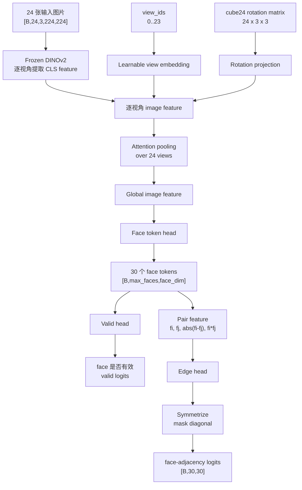
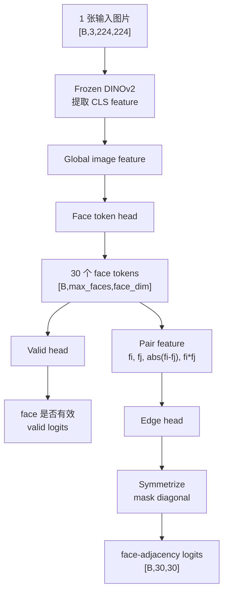

# 2026-06-01 拓扑预测实验记录

## 数据完整性

- 数据迁移到 `deepcad_v7_cond` 之后，发现部分 condition 文件已经损坏。
- 现象：训练会在 PyTorch `DataLoader` worker 里失败，NumPy 读取一个已经存在的 `.npz` 文件时触发解压错误，例如：

```text
zlib.error: Error -3 while decompressing data: invalid code lengths set
```

- 目前观察到的文件类型：单张灰模拓扑预测脚本读取 `svr.npz` 的 `images` 数组时出错。
- 这说明只做存在性检查是不够的。类似 `has_required_condition_files` 的逻辑只能确认文件在不在，不能保证 `.npz` 内容可以被正常解压。
- 当前 toy topology 脚本已经在 `__getitem__` 中捕获常见 `.npz` 读取/解压错误，打印坏样本的 `model_id`，跳过该样本并继续训练。
- 后续：这轮可行性实验结束后，应该扫描 `deepcad_v7_cond` 中损坏的 `.npz` 文件，并重新生成或移除对应的 condition 文件夹。

## 24 视角条件输入

- 最初的 `svr24` 和 `sketch24` toy model 直接对 24 张图的 DINOv2 CLS feature 做平均。
- 这个做法会丢掉显式视角/camera/rotation 信息。
- 当前 `svr24` 和 `sketch24` 脚本已经改成：
  - 每个样本带 cube24 的 `view_ids = 0..23`
  - 学习一个 view embedding
  - 将 cube24 rotation matrix 投影成 rotation embedding
  - 用 attention pooling 聚合 24 个视角的 image feature


## 模型架构图

当前四个 toy model 都只训练一个 topology predictor，不接 diffusion model。DINOv2 backbone 是 frozen 的，训练参数主要集中在 image aggregation、face token head、valid head 和 edge head。

### 24 视角模型：`svr24` / `sketch24`



### 单图模型：`real_photo` / `svr_single`



### 共享预测头和 loss

```text
image(s)
  -> frozen DINOv2 CLS feature
  -> global image feature
  -> face_head
  -> max_faces 个 face token
      -> valid_head -> valid_logits
      -> pairwise edge_head -> edge_logits -> symmetric face-adjacency matrix

loss = weighted_edge_bce + 0.5 * valid_bce
```

- `valid_head` 学的是哪些 face slot 是真实 face，哪些是 padding。
- `edge_head` 只在真实 face pair 的上三角位置计算 loss，并对正样本边做 reweight，缓解 adjacency matrix 稀疏导致的类别不平衡。
- 输出矩阵会被对称化，并把 diagonal mask 掉，因为 face 不应该和自己相邻。
- 24 视角版本相比最初版本多了 `view embedding + rotation embedding + attention pooling`，避免简单平均 24 个视角时丢掉相机/旋转信息。

## 第一轮训练状态

- `real_photo` 和 `svr_single` 已经完成训练，并生成了 validation `metrics.json`。
- `svr24` 和 `sketch24` 第一轮没有真正开始训练。两个日志都在 import 阶段失败，错误是：

```text
ModuleNotFoundError: No module named src
```

- 原因：脚本是通过 `python experiments/2026-06-01/topology_from_*.py` 直接启动的，此时 repository root 不一定在 `sys.path` 里；而 24 视角脚本新增了 `src.brepnet.data.rotations` 的导入。
- 修复：`topology_from_svr24.py` 和 `topology_from_sketch24.py` 已经在导入 cube24 rotation helper 之前，把 repository root 插入 `sys.path`。
- 已新增 `train_remaining_24view_topology.sh`，用于只补跑剩下两个 24-view 模型。补跑日志路径：
  - `experiments/2026-06-01/logs/svr24_retry.log`
  - `experiments/2026-06-01/logs/sketch24_retry.log`

## 已完成模型的验证指标

下面是 `metrics.json` 中保存的 best validation metrics，不是 held-out test metrics。

| 模型 | val_loss | edge_ap | edge_auc | edge_f1 | edge_iou | face_count_mae | exact_matrix_acc |
| --- | ---: | ---: | ---: | ---: | ---: | ---: | ---: |
| `real_photo` | 0.8714 | 0.5979 | 0.7265 | 0.5723 | 0.4008 | 1.60 | 0.0026 |
| `svr_single` | 0.8822 | 0.5830 | 0.7200 | 0.5675 | 0.3962 | 1.74 | 0.0029 |

## 指标解释

- `val_loss`：验证集总 loss。脚本中总 loss 是 `edge_loss + 0.5 * valid_loss`。这个值越低越好，但它受正负样本加权影响，不能单独作为最终判断。
- `edge_ap`：face-adjacency 边预测的 average precision，衡量模型给真实拓扑边排序的能力。越高越好。它比固定阈值下的 F1 更适合判断模型是否学到了可分信号。
- `edge_auc`：ROC-AUC，衡量真实边和非边的整体可分性。0.5 接近随机，越接近 1 越好。
- `edge_f1`：把预测概率用阈值 0.5 二值化后，对 adjacency matrix 上三角边计算的 F1。越高越好，直接反映当前阈值下输出矩阵的质量。
- `edge_iou`：预测边集合和真实边集合的交并比。越高越好，比 F1 更严格一些。
- `face_count_mae`：预测 face 数量和真实 face 数量之间的平均绝对误差。越低越好。这个指标影响最终输出矩阵的尺寸可靠性。
- `exact_matrix_acc`：整张 face-adjacency matrix 完全预测正确的比例。这个指标非常严格，只要一个边错了就算失败，所以早期实验里数值很低是正常的。

当前解读：两个单图模型已经显示出非随机的拓扑信号，`edge_auc` 大约 0.72，`edge_f1` 大约 0.57；但它们还不是强拓扑预测器。`real_photo` 在这轮略好于 `svr_single`。`face_count_mae` 仍然在 1.6-1.7 左右，说明 face 数预测还有明显噪声。

## 24 视角阶段性结果和发现

`svr24` 和 `sketch24` 目前都已经跑到第 18/20 个 epoch 左右，虽然还差最后约 2 个 epoch，但 best validation checkpoint 已经比较明确。两个 24-view 模型的 best checkpoint 都出现在第 7 个 epoch 附近；后续 train loss 持续下降，但 validation loss 上升，`edge_ap`/`edge_auc` 下降，说明模型已经开始过拟合。

### 24-view best validation metrics

| 模型 | best epoch | val_loss | edge_ap | edge_auc | edge_f1 | edge_iou | recall@GT | face_count_mae | exact_matrix_acc |
| --- | ---: | ---: | ---: | ---: | ---: | ---: | ---: | ---: | ---: |
| `svr24` | 7 | 0.8042 | 0.6131 | 0.7345 | 0.5759 | 0.4044 | 0.5956 | 0.88 | 0.0297 |
| `sketch24` | 7 | 0.8115 | 0.6092 | 0.7306 | 0.5732 | 0.4018 | 0.5932 | 1.00 | 0.0240 |

### 和单图模型对比

| 模型 | edge_ap | edge_auc | edge_f1 | edge_iou | face_count_mae | exact_matrix_acc |
| --- | ---: | ---: | ---: | ---: | ---: | ---: |
| `svr24` | 0.6131 | 0.7345 | 0.5759 | 0.4044 | 0.88 | 0.0297 |
| `sketch24` | 0.6092 | 0.7306 | 0.5732 | 0.4018 | 1.00 | 0.0240 |
| `real_photo` | 0.5979 | 0.7265 | 0.5723 | 0.4008 | 1.60 | 0.0026 |
| `svr_single` | 0.5830 | 0.7200 | 0.5675 | 0.3962 | 1.74 | 0.0029 |

### 结论

- 增加图片数量本身带来的边分类提升不大。`svr24`/`sketch24` 的 `edge_ap`、`edge_auc`、`edge_f1` 只比单图模型略高。
- 24-view 最明显的收益在 `face_count_mae` 和 `exact_matrix_acc`：
  - `face_count_mae` 从单图的约 1.6-1.7 降到 0.88-1.00。
  - `exact_matrix_acc` 从单图的约 0.002-0.003 提升到 0.024-0.030。
- 这说明多视角更有助于判断物体整体结构复杂度和 face 数量，但对“哪些 face 两两相邻”的 topology edge 分类帮助有限。
- 当前 toy setup 的瓶颈可能不是图片数量，而是输出表示方式：模型用固定顺序的 padded face slots 预测 adjacency matrix，本质上不是 permutation-invariant graph prediction，也没有显式建模 CAD face 实体。
- 后续如果继续做 topology predictor，应该优先考虑更合理的拓扑输出建模，而不是单纯增加视角数量。例如：先预测 face/entity proposals，再预测 graph；或者使用 set/graph matching、permutation-invariant loss、structured graph decoder。
- `svr24` 日志中仍然出现坏样本 `00750732` 的 `.npz` 解压错误并被跳过；`sketch24` 暂未观察到同类 skip。
