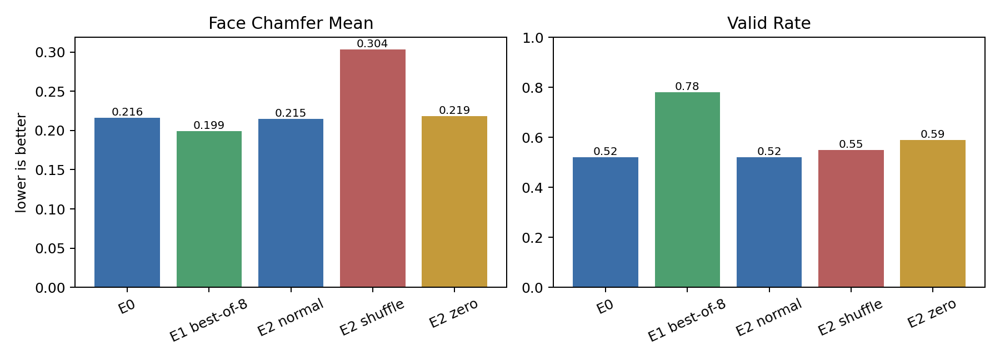
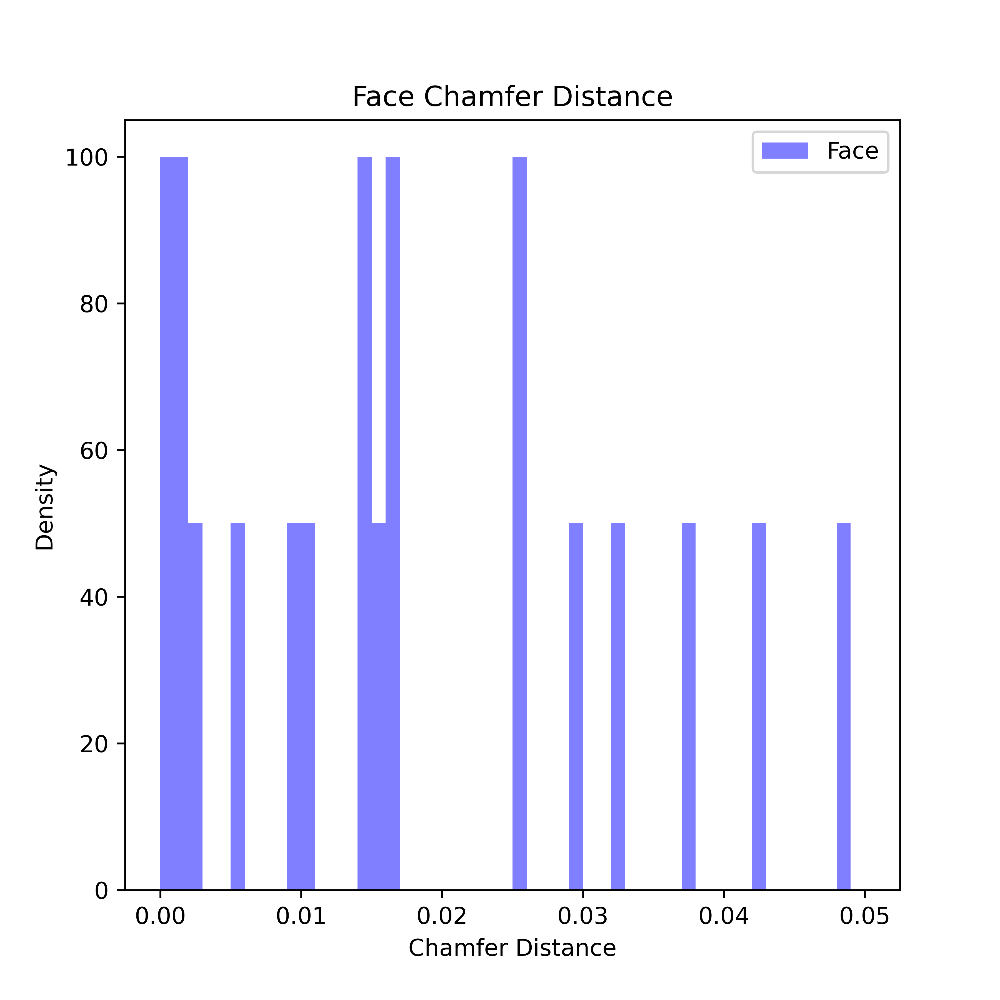
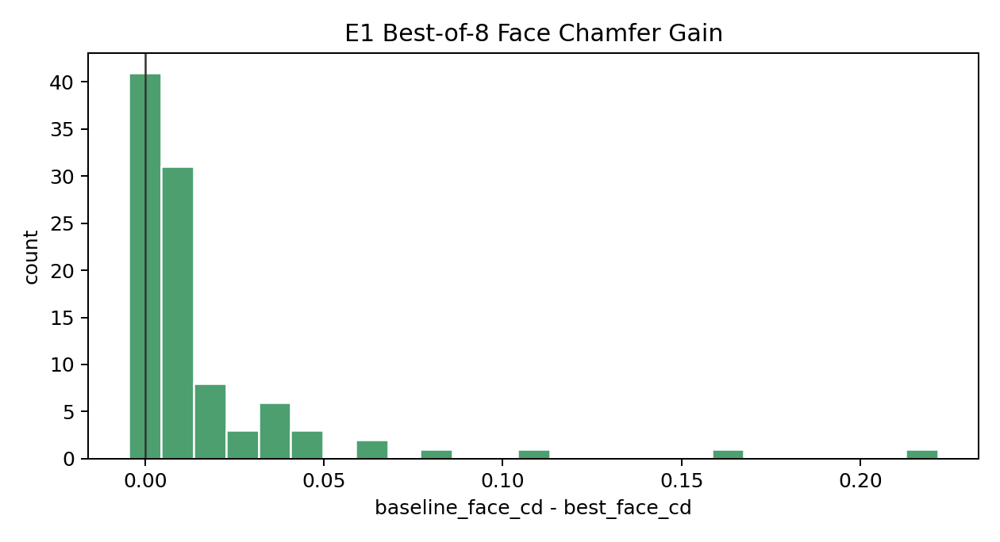
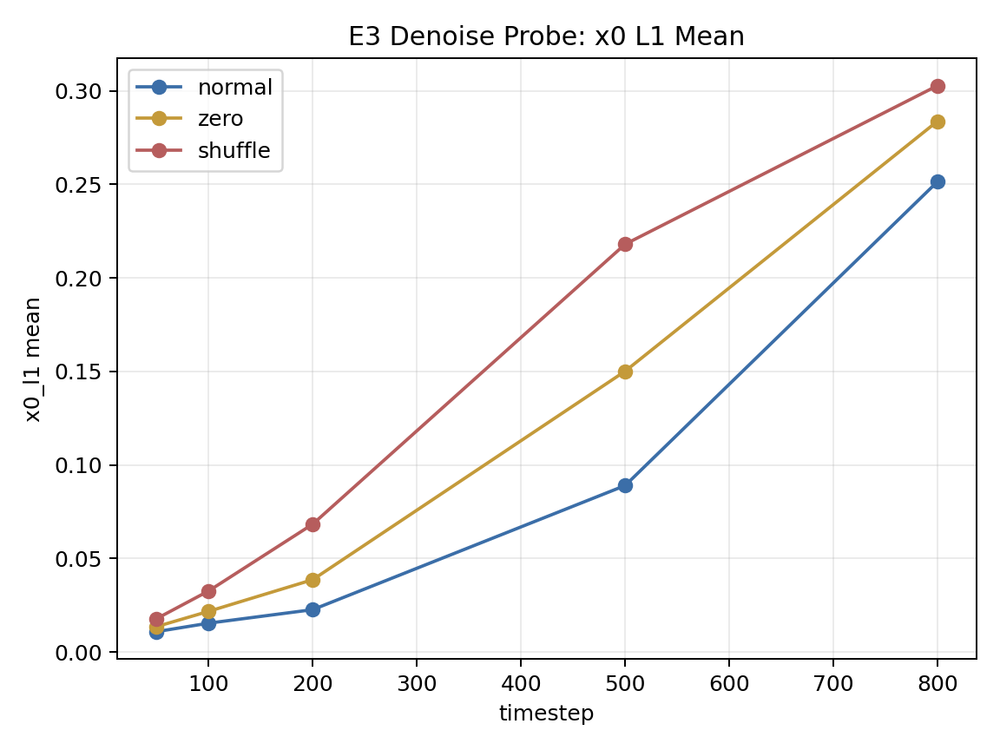
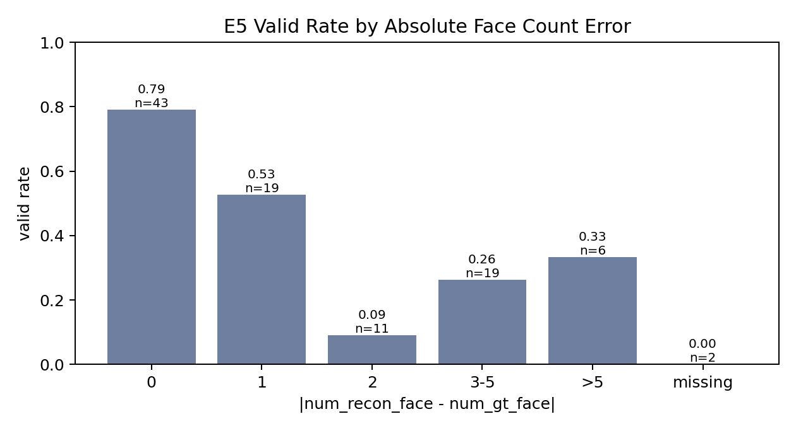

# 0502 Depth 条件扩散实验结果总结

生成日期：2026-05-10  
结果根目录：`/mnt/d/data/new_cond_results/exp_plan_0502_depth`  
Checkpoint：`/mnt/d/data/new_cond_ckpt/0502_deepcad_flux_single_view_align_depth.ckpt`  
测试集：`src/brepnet/data/list/deduplicated_deepcad_testing_7_30_sample_100.txt`

## 0. 完整性检查

当前结果目录里已经生成：

| 实验 | 状态 | 主要输出 |
|---|---:|---|
| E0 baseline | 已完成 | `E0_baseline_summary.json/csv` |
| E1 K-sampling oracle | 已完成，K=8 | `E1_ksample/oracle_summary.json/csv` |
| E2 condition sensitivity | 已完成 | `normal/shuffle/zero_summary.json/csv` |
| E3 denoise GT probe | 已完成 | `E3_denoise_probe/denoise_errors.json/csv` |
| E5 face count/topology | 已完成 | `E5_face_count/face_count_summary.json/csv` |
| E4 align loss ablation | 未生成 | 需要重训/复制模型变体后再跑 |
| E6 projection rerank | 未生成 | 需要 2D projection/rerank 实现 |
| E7 alignment check | 未生成 | 需要额外可视化/数据一致性检查 |

报告里的结论只基于已生成的 E0/E1/E2/E3/E5。

## 1. 总览



核心数字如下：

| 实验 | face_cd mean | face_cd median | valid rate | 备注 |
|---|---:|---:|---:|---|
| E0 baseline | 0.2163 | 0.1416 | 0.52 | 单次正常 condition 采样 |
| E1 best-of-8 oracle | 0.1991 | 0.1240 | 0.78 | 这里的 valid 是 K 个候选里任意一个 valid |
| E2 normal | 0.2152 | 0.1434 | 0.52 | 与 E0 基本一致 |
| E2 shuffle | 0.3038 | 0.2943 | 0.55 | 错图条件，几何指标明显变差 |
| E2 zero | 0.2188 | 0.1799 | 0.59 | 无图条件，valid 偏高但 F-score 明显差 |

第一结论：`valid rate` 单独看会误导。`zero` 和 `shuffle` 的 valid rate 并不低，但它们的 face/edge/vertex F-score 明显劣化，说明 OCC 构造成功不等于和输入图对应。

第二结论：condition 是有效的。`shuffle` 后 face_cd 从 0.2152 退化到 0.3038，face_fscore 从 0.2109 退化到 0.0777；这说明模型不是完全忽略图像。

第三结论：condition 的精确约束仍然不够。`zero` 的 face_cd mean 接近 normal，但 face_fscore、edge_fscore、vertex_fscore 大幅下降，且平均重建面数从约 12 张降到约 8 张，说明无条件 prior 可以造出“可构造”的 CAD，但不一定是对的 CAD。

## 2. E0 Baseline

E0 是当前 checkpoint 的单次正常采样基线：

| 指标 | 数值 |
|---|---:|
| num_rows | 100 |
| num_success | 52 |
| valid_rate | 0.52 |
| missing_eval_count | 2 |
| missing_eval_prefixes | `00317172`, `00035085` |
| num_recon_face / num_gt_face mean | 11.91 / 12.09 |
| abs_face_count_error mean | 1.49 |
| face_cd mean / median | 0.2163 / 0.1416 |
| edge_cd mean / median | 0.3353 / 0.2566 |
| vertex_cd mean / median | 0.7646 / 0.5755 |
| face_fscore mean | 0.2092 |
| fe_fscore mean | 0.5178 |
| ev_fscore mean | 0.5215 |

E0 face chamfer 分布如下：



E0 的作用是定基线。它本身不能判断失败原因，只说明当前完整链路在 100 个样本上的表现是：约一半能构造成功，但几何匹配质量仍然低。

## 3. E1 K-sampling Oracle

E1 对每个输入图采样 8 次，然后用 GT 指标事后挑 best face_cd。这不是部署方法，是诊断：看正确答案是否“存在于采样分布里”。



结果：

| 指标 | 数值 |
|---|---:|
| K | 8 |
| baseline face_cd mean / median | 0.2163 / 0.1416 |
| best-of-8 face_cd mean / median | 0.1991 / 0.1240 |
| mean oracle gain | 0.0159 |
| median oracle gain | 0.0063 |
| baseline valid_rate | 0.52 |
| any-valid-in-8 rate | 0.78 |
| 平均 valid candidates / 8 | 4.38 |
| 有至少一个 valid candidate 的样本数 | 78 / 100 |
| face_cd gain > 0 的样本数 | 88 / 100 |

收益最大的几个样本：

| prefix | baseline face_cd | best face_cd | gain | best sample | valid candidates |
|---|---:|---:|---:|---:|---:|
| 00607531 | 0.3951 | 0.1733 | 0.2218 | 5 | 0 |
| 00605944 | 0.3538 | 0.1910 | 0.1627 | 5 | 1 |
| 00791223 | 0.5238 | 0.4134 | 0.1104 | 7 | 5 |
| 00987922 | 0.1516 | 0.0707 | 0.0808 | 4 | 0 |
| 00695241 | 0.5417 | 0.4740 | 0.0677 | 4 | 6 |

解释：多采样确实能提高上限，尤其 valid candidate 覆盖率从 52% 提到 78%。但 face_cd 的 mean 只从 0.2163 到 0.1991，提升不算巨大。更重要的是，best face_cd 经常不是 valid candidate，说明“几何接近”和“BRep 可构造”没有被同一个机制同时优化。

工程含义：E1 支持做 reranking，但 reranking 不能只看 valid，也不能只看 latent/Chamfer，需要加入 2D 投影一致性和拓扑约束。

## 4. E2 Condition Sensitivity

E2 比较 `normal / shuffle / zero` 三种条件。关键指标：

| condition | face_cd mean | face_fscore mean | edge_fscore mean | vertex_fscore mean | fe_fscore mean | ev_fscore mean | valid_rate | abs face err |
|---|---:|---:|---:|---:|---:|---:|---:|---:|
| normal | 0.2152 | 0.2109 | 0.1637 | 0.1661 | 0.5200 | 0.5235 | 0.52 | 1.44 |
| shuffle | 0.3038 | 0.0777 | 0.0535 | 0.0425 | 0.3547 | 0.3499 | 0.55 | 5.40 |
| zero | 0.2188 | 0.1040 | 0.0409 | 0.0131 | 0.4785 | 0.4490 | 0.59 | 4.55 |

判断：

1. `normal` 明显优于 `shuffle`，说明 condition identity 被模型使用了。
2. `zero` 的 valid rate 更高不是好事。它的 face/edge/vertex F-score 很差，而且平均重建 face 数只有 7.93，而 GT 平均是 12.07。这像是无条件 prior 生成了更简单、更容易构造的形状。
3. `shuffle` 的 face count error 最大，说明错误图像会把模型推向错误 topology。

E2 的核心结论：模型不是“没看图”，而是“看图后能改善几何匹配，但图像条件还不能强约束精确拓扑和面片数量”。

## 5. E3 Denoise GT Probe

E3 不从纯噪声生成，而是把 GT latent 加噪到不同 timestep，再让模型 denoise 回 GT latent。它直接测 diffusion denoising 能力，尤其是高噪声阶段 condition 能不能锁住全局结构。



`x0_l1 mean`：

| timestep | normal | zero | shuffle |
|---:|---:|---:|---:|
| 50 | 0.0109 | 0.0136 | 0.0178 |
| 100 | 0.0154 | 0.0218 | 0.0326 |
| 200 | 0.0227 | 0.0387 | 0.0684 |
| 500 | 0.0890 | 0.1501 | 0.2180 |
| 800 | 0.2515 | 0.2838 | 0.3028 |

判断：

1. 所有 timestep 都是 `normal < zero < shuffle`，condition 是有效的。
2. 低噪声阶段 normal 很好，说明局部修复能力存在。
3. 高噪声阶段 normal 仍然误差很大，尤其 t=800 的 `x0_l1=0.2515`。这说明完整采样早期，全局结构仍然主要受 CAD prior 控制，图像条件不足以锁住精确 CAD latent。

E3 对模型优化的指向很明确：优先增强高 timestep 的 condition 控制力，而不是盲目继续换 image backbone。

## 6. E5 Face Count / Topology

E5 统计 face count error 和 valid/topology 指标的关系。



按绝对 face count error 分桶：

| abs face count error | count | valid_rate | fe_fscore mean | ev_fscore mean | face_cd mean |
|---|---:|---:|---:|---:|---:|
| 0 | 43 | 0.7907 | 0.6296 | 0.6210 | 0.2442 |
| 1 | 19 | 0.5263 | 0.5600 | 0.6086 | 0.2097 |
| 2 | 11 | 0.0909 | 0.3382 | 0.3559 | 0.2373 |
| 3-5 | 19 | 0.2632 | 0.3872 | 0.3735 | 0.1532 |
| >5 | 6 | 0.3333 | 0.3263 | 0.3051 | 0.1994 |
| missing | 2 | 0.0000 | - | - | - |

按方向：

| direction | count | valid_rate | abs face err mean | fe_fscore mean | ev_fscore mean |
|---|---:|---:|---:|---:|---:|
| exact | 43 | 0.7907 | 0.00 | 0.6296 | 0.6210 |
| under | 33 | 0.4242 | 2.48 | 0.4821 | 0.5008 |
| over | 22 | 0.1818 | 2.91 | 0.3531 | 0.3582 |
| missing | 2 | 0.0000 | - | - | - |

这个结果很关键：face count 一旦错得超过 1，valid rate 和 topology F-score 会明显下滑。尤其 over-face 的 valid rate 只有 0.1818，说明“多生成面”对 BRep 构造很伤。

同时要注意：valid 样本的 face_cd mean 反而高于 invalid 样本，这再次说明 chamfer 和 valid/topology 不是同一个目标。当前系统需要同时优化几何一致性和拓扑/装配一致性。

## 7. 结论

当前结果不支持“condition 完全没用”这个判断。E2 和 E3 都说明模型使用了图像条件。

真正的问题更像是：

```text
conditional latent diffusion 学到了一定的 image-to-CAD 关联，
但在高噪声采样早期无法把全局结构、face 数量和拓扑装配锁定到输入图像。
```

具体证据：

1. E2 normal 明显优于 shuffle，condition identity 有效。
2. E3 normal 在所有 timestep 都优于 zero/shuffle，但高 t 误差仍大。
3. E1 best-of-8 有提升，说明采样分布里有更好候选，但 oracle gain 不够大，不能只靠多采样解决。
4. E5 显示 face count error 和 valid/topology 强相关，尤其 over-face 很致命。

## 8. 下一步优先级

我建议按这个顺序推进：

1. 做 inference-only CFG 或 high-t guidance sweep。先不用重训，测 `scale=1.5/2.0/3.0`，重点看 E0/E1 是否提升。
2. 做 E6 projection rerank。E1 显示 K=8 已经让 any-valid 到 0.78，但需要不用 GT 的 selector。
3. 训练时加 high-t `x0_pred` auxiliary loss。E3 直接暴露高噪声阶段 x0 误差大。
4. 在 diffusion 主干深层重复注入 condition，避免只在前面 cross-attn 一次后被 24 层 self-attn 冲淡。
5. 加 face existence / face count head。E5 说明 face 数量错误会显著损害 valid 和拓扑指标。
6. 补 E7 alignment check。因为一旦 camera/crop/condition 对齐有系统偏差，所有模型侧结论都需要降级。

短期最实际的路线是：

```text
CFG/high-t guidance -> K-sampling + 2D projection rerank -> face count/existence 约束
```

这条线和现有结果最匹配，也最少依赖大规模重构。
